# 🌀 Automated Dropzone Ingestion
### This project provides a reusable template for automated, local-first data processing and delivery to Amazon S3, with multi-stage logging and support for both local execution and Docker-based runs.

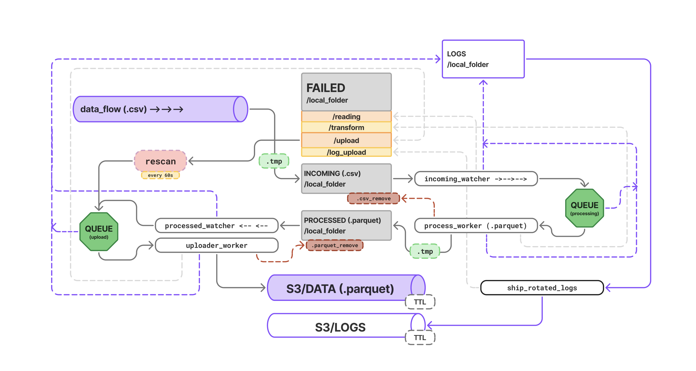

## Project Features

- CSV → Parquet transformation (customizable)
- Synthetic data generator for testing
- Local raw / processed data layers
- Two-queue architecture: processing queue and upload queue
- File system–based ingestion with event-driven detection
- Safe file ingestion via temporary `.tmp` files to prevent reading partially written files
- Failure handling with local persistence in failed/
- Rescan-based reconciliation for incoming data and failed S3 uploads
- Layered logging architecture with dedicated loggers:
  - `dropzone.reading` — file ingestion and filesystem events
  - `dropzone.processing` — CSV validation, transformation, and Parquet generation
  - `dropzone.uploader` — S3 upload lifecycle, retries, and failure handling

# Project Structure 📁
```text
automated-dropzone-ingestion/
├── aws/
│   └── s3_utils.py                 # S3 key generation and upload logic (keys, partitions)

├── incoming_watcher/
│   ├── watcher.py                  # Filesystem watcher (incoming files)
│   └── process_worker.py           # Processing + rescan (CSV → DataFrame → Parquet)

├── s3_upload/
│   ├── s3_parquet_uploader.py      # Processed Parquet watcher + thread startup
│   └── uploader_worker.py          # Upload queue, workers, and rescan logic

├── log_shipper/
│   └── log_shipper.py              # Log discovery and upload to S3

├── synth_data/
│   ├── gen_synth_data.py           # Synthetic CSV generator (test-only)
│   └── values.py                   # Reference values for synthetic data

├── utils/
│   └── queue_utils.py              # Shared queue utilities

├── file_storage/
│   ├── incoming/                   # Incoming raw CSV files
│   ├── processed/                  # Generated Parquet files
│   ├── failed/                     # Failed files by stage
│   │   ├── read/
│   │   ├── transform/
│   │   └── upload/
│   └── failed_logs/                # Failed log upload artifacts

├── logging_config.py               # Logging setup and rotation
├── docker-compose.yml              # Multi-container local pipeline
├── Dockerfile
├── requirements.txt
├── .env
├── .env.docker
├── .gitignore
├── .dockerignore
└── README.md
```

# How to test 👶

```
git clone https://github.com/yanashcherbakova/automated-dropzone-ingestion.git
cd automated-dropzone-ingestion
```

## Option A --> Run with Docker Compose 🐳

1. Create `.env.docker`

```
AWS_REGION=(us-east-1)
S3_BUCKET=(your-bucket)
S3_PREFIX=(data)

INCOMING_DIR=/app/file_storage/incoming
PROCESSED_DIR=/app/file_storage/processed

FAILED_DIR_READ=/app/file_storage/failed/read
FAILED_DIR_TRANSFORM=/app/file_storage/failed/transform
FAILED_DIR_UPLOAD=/app/file_storage/failed/upload

WATCHDOG_POLLING=1
```
2. `docker compose up --build`

This command starts three Docker containers, each running a dedicated Python service:
- **CSV generator (test-only)**
    - Generates synthetic transaction CSV files and drops them into the incoming folder.
    - This container exists only to validate that the end-to-end pipeline works.
- **Processor**
    - Watches the incoming folder, loads CSV files into `pandas DataFrames`, performs cleaning and validation, converts them to Parquet, stores them in the processing directory, and removes the original CSV files.
- **Uploader**
    - Detects newly created `Parquet files`, enqueues them, and uploads them to `Amazon S3` using the configured bucket and prefix.

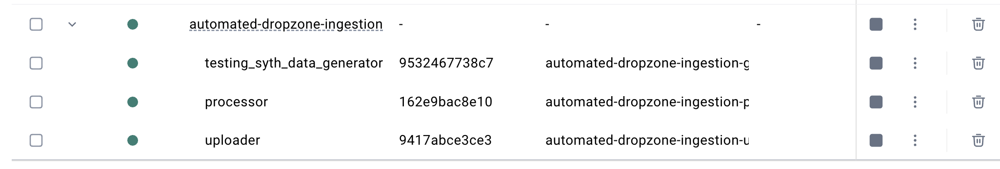
3. Follow logs
```
docker compose logs -f processor
docker compose logs -f uploader
```
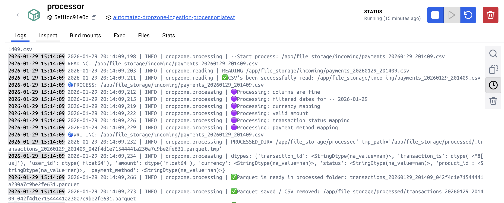
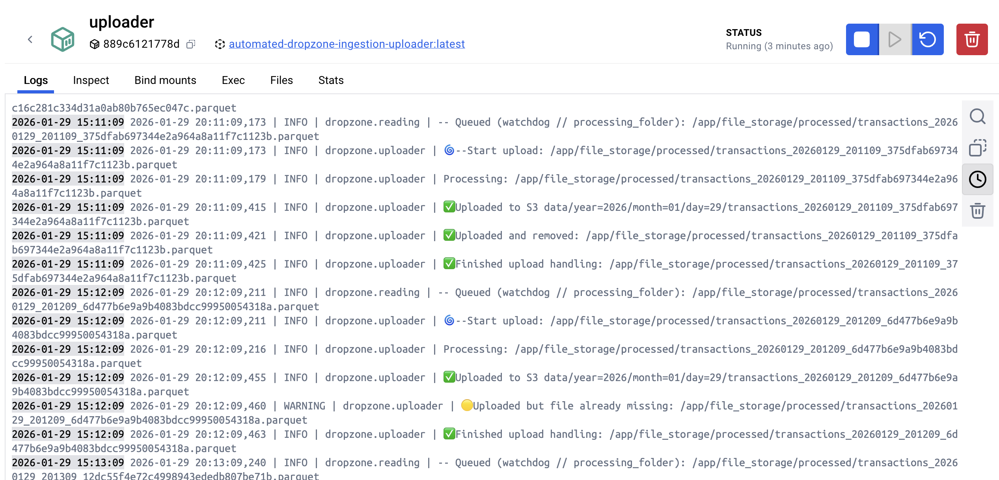

## Option B --> Run locally (no Docker)

1. Create and activate venv
```
python3 -m venv .venv
source .venv/bin/activate
pip install -r requirements.txt
```
2. Create `.env`
```
AWS_REGION=(us-east-1)
S3_BUCKET=(your-bucket)
S3_PREFIX=(data)

INCOMING_DIR=./file_storage/incoming
PROCESSED_DIR=./file_storage/processed

FAILED_DIR_READ=./file_storage/failed/read
FAILED_DIR_TRANSFORM=./file_storage/failed/transform
FAILED_DIR_UPLOAD=./file_storage/failed/upload

WATCHDOG_POLLING=0
```
3. Start services (3 terminals)
- **Terminal 1 - generator *(optional)***
    - `python3 -m synth_data.gen_synth_data`
- **Terminal 2 - processor**
    - `python3 -m incoming_watcher.watcher`
- **Terminal 3 - uploader**
    - `python3 -m s3_upload.s3_parquet_uploader`

4. Validate
- A new CSV should appear in `file_storage/incoming/`
- Processor should create Parquet in `file_storage/processed/`
- Uploader should upload Parquet to S3 and then remove it locally (or move to `failed/upload` on errors)

Logs example / Generator

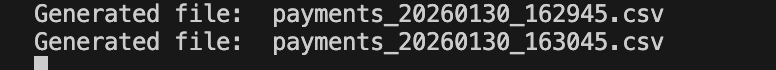

Logs example / Processor

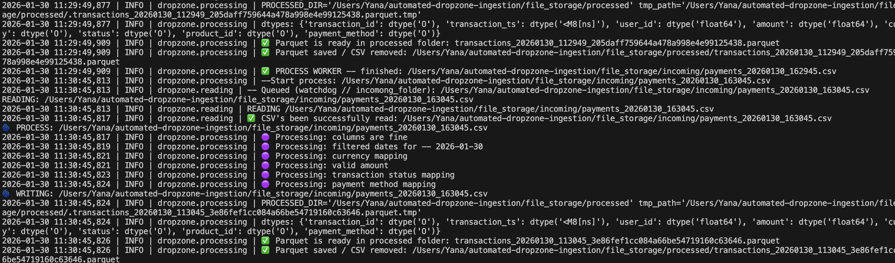

### Finally

### 🧩 Check S3 Bucket:

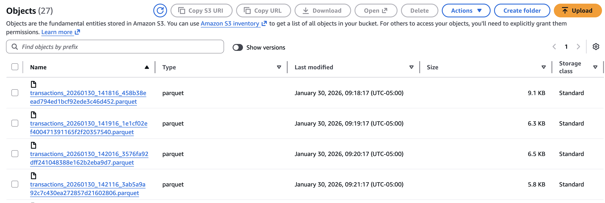

Each file follows the same end-to-end path through the pipeline.

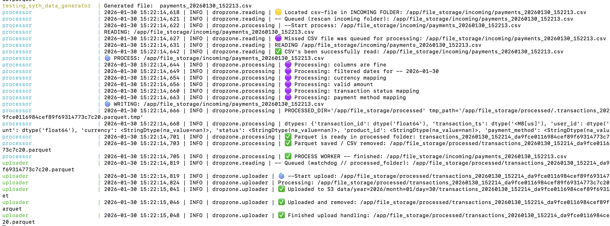

Different processing stages can be identified by the **container names** that emit the logs.  
The same separation is also visible in the unified log stream, which is grouped into three logical domains:

- `dropzone.reading` — file ingestion and filesystem events
- `dropzone.processing` — CSV validation, transformation, and Parquet generation
- `dropzone.uploader` — S3 upload lifecycle, retries, and failure handling

# Fast customization 🏂 What to customize?


## 1. Data Flow (Data Source)

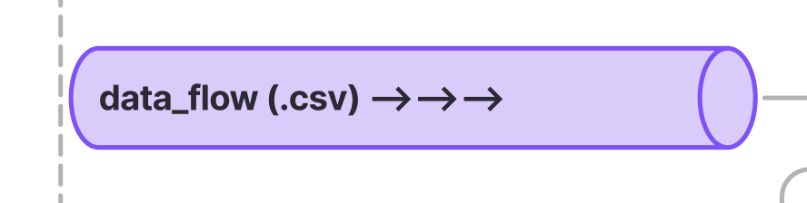

- This project generates a **synthetic transaction table** used to simulate a real data flow.
- In a production pipeline, this component would be replaced by an actual data source (for example, an upstream service, external provider, or ingestion endpoint).

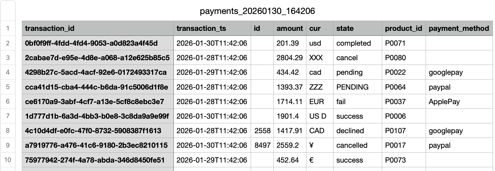

The data is delivered in **CSV format**.

### 🧩 Check: `incoming_watcher/watcher.py`

**❗Important:** at the moment, the pipeline ingests data from CSV and loads it into a pandas DataFrame. All downstream processing (validation, cleaning, transformations) is implemented at the DataFrame level.

If a different input format is required (e.g. Parquet, JSON, Avro), the downstream processing logic must be adapted accordingly, rather than only swapping the input file.

## 2. Process worker

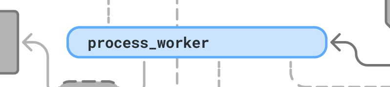

As described earlier, incoming CSV files are loaded into pandas DataFrames, then passed through cleaning and validation steps, for example:

- column name normalization
- standardizing currency codes / payment method names
- basic sanity checks (nulls, types, ranges, etc.)

The resulting DataFrame is then written to Parquet and moved to: `folder_sorage/processing`

### 🧩 Check: `incoming_watcher/process_worker.py`

### Customizing the processing logic

You can fully replace the processing logic inside: `def process_file(file_path):`

**❗Important:** downstream components detect and enqueue Parquet files from the processing folder.
If you change where Parquet files are written, their naming, or their schema, review the downstream logic here:

- `s3_upload/s3_parquet_uploader.py`
- `s3_upload/uploader_worker.py`

### Customizing S3 key / partitioning

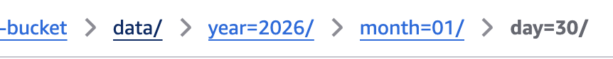

S3 object naming and partitioning is defined in: 
- `aws/s3_utils.py` (s3_key)

Current partitioning format: **year=YYYY/month=MM/day=DD**

## 3. LOGS


### 🧩 Check: 
- `logging_config.py`
    - change log rotation settings (max size / number of backups)
    - adjust log format (timestamps, logger name, level, message)
- `incoming_watcher/watcher.py`
    - starts a background thread responsible for shipping logs to S3
- `log_shipper/log_shipper.py`
    - implements the actual log shipping logic

## Rescan cases

### Case 1 - Files stuck in the incoming folder 📥⏸️

In this test scenario, a batch of CSV files remains unprocessed in the incoming folder.

This can happen in the following situations:
- ⏳ The data source delivered files while the processor container (or the processor script in local mode) was not running
- 🐳 In a Docker setup, the data-producing container started earlier than the processor
(`depends_on` in Docker Compose helps with startup order but doesn`t provide a strict guarantee)
- 👀 The filesystem watcher missed the file creation event

As a result, files remain unnoticed in the incoming directory:

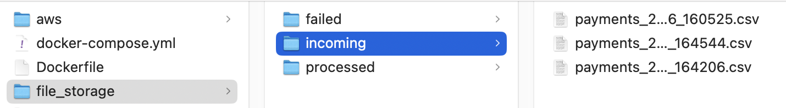

To handle this, a **periodic rescan** mechanism is used. 
By default, **every 60 seconds**, the rescan checks the incoming folder and enqueues all eligible files. File validation and queue deduplication are handled inside:
- `incoming_watcher/process_worker.py`

This ensures that previously missed files are picked up and re-introduced into the pipeline

In the logs, it is clearly visible that the file was enqueued by the rescan process, not by the watcher:

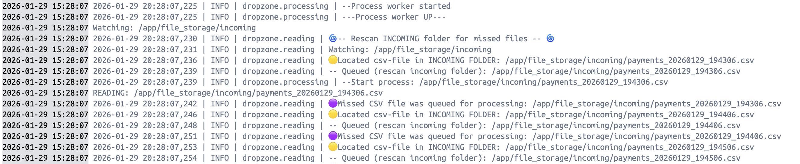

### Case 2 - Network connectivity loss during S3 upload 🔌⬇️

Network outages are usually unpredictable.
In this test case, the failure is intentionally reproduced to validate retry and rescan logic 🙂


The S3 delivery logic performs multiple retry attempts.
If all retries fail, the file is moved to:

`file_storage/failed/upload`

In this scenario, the folder contains **fully processed Parquet files** —
i.e. files from the processed layer that were not delivered to S3:

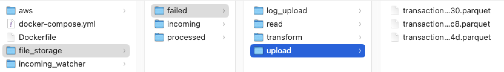

The rescan mechanism periodically checks this directory and selects only Parquet files.
These files are then enqueued for another upload attempt.

Again, the logs explicitly indicate that the file was queued by the **rescan logic**:

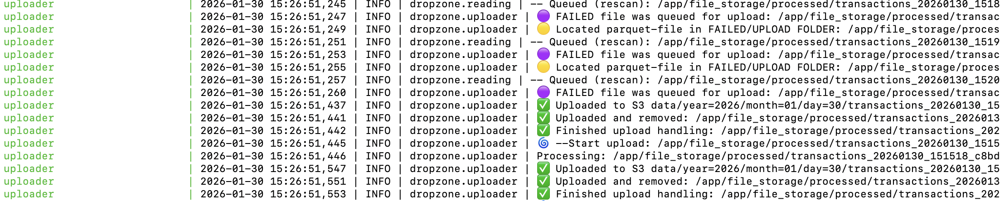