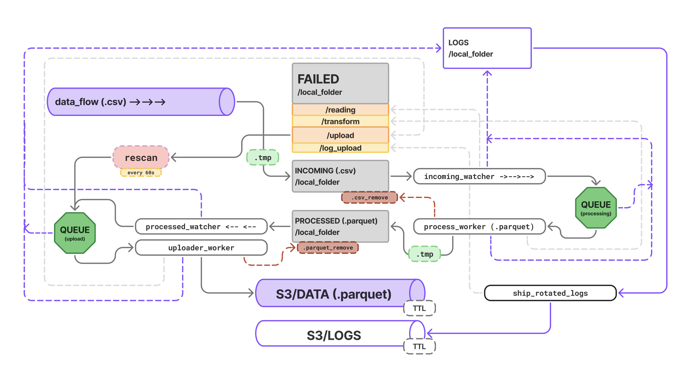

# Automated Dropzone Ingestion
This project provides a template for local data cleaning, validation, and delivery to Amazon S3

## Project Features

- CSV → Parquet transformation (customizable)
- Synthetic data generator for testing -- `gen_synth_data.py`
- Local raw / processed data layers
- Two-queue architecture: processing queue and upload queue
- Failure handling with local persistence in failed/
- Rescan and retry logic for failed S3 uploads